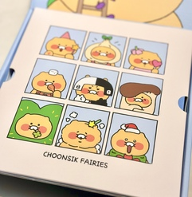

# 🕵️‍♂️ 흑백요리사 식당 리뷰 감성 분석, 평가 및 추천 시스템

  

## 🌟 소개
'흑백요리사' 열풍으로 인해 요식업계에 대한 관심이 높아지고 있습니다. 이러한 트렌드에 발맞춰 식당 리뷰 데이터를 활용한 감성 분석, 평가 및 추천 시스템을 개발하고자 합니다. 이 프로젝트는 고객 리뷰를 분석하고, 소비자에게는 개인화된 맛집 추천 서비스를 제공하는 것을 목표로 합니다.  

## 🚀 프로젝트 특징
### 1. 네이버 리뷰 크롤링
- **설명**: 네이버에서 음식점 리뷰를 크롤링하여 데이터를 수집합니다.
- **기술 스택**: Python, Selenium

### 2. 리뷰 감성 라벨링
- **설명**: KoELECTRA-Base-v3 모델을 사용하여 수집된 리뷰의 긍정/부정을 라벨링합니다.
- **모델**: [KoELECTRA-Base-v3](https://huggingface.co/monologg/koelectra-base-v3-discriminator)

### 3. 감성 점수 부여
- **설명**: llama-3-Korean-Bllossom-8B 모델을 통해 각 리뷰에 감성 점수를 부여합니다.
- **모델**: [llama-3-Korean-Bllossom-8B](https://huggingface.co/MLP-KTLim/llama-3-Korean-Bllossom-8B)

### 4. 데이터 시각화 및 추천 시스템
- **설명**: Streamlit을 이용하여 최종 데이터를 시각화하고, 사용자가 입력한 음식명을 기반으로 데이터에 있는 식당을 추천합니다.
- **기술 스택**: Streamlit

### 5. 프로세스 자동화
- **설명**: 전체 데이터 수집, 처리, 모델 학습 및 배포 과정을 Airflow로 자동화하여 효율적인 워크플로우를 구축하였습니다.
- **기술 스택**: [Apache Airflow](https://airflow.apache.org/)

### 6. 모델 관리 및 추적
- **설명**: MLflow를 활용하여 모델의 버전 관리, 실험 추적 및 배포 과정을 기록하고 관리합니다.
- **기술 스택**: [MLflow](https://mlflow.org/)

### 7. 모델 개선 및 업데이트
- **설명**:
  - 새로운 리뷰가 수집될 때마다 데이터 처리를 수행하고, 모델을 재학습하여 지속적으로 성능을 개선합니다.
  - 대규모 모델인 llama-3-Korean-Bllossom-8B는 학습보다는 RAG(Retrieval-Augmented Generation) 방식을 통해 성능을 향상시킵니다.

## 🛠 기술 스택

- **데이터 수집**: Python, Selenium
- **데이터 처리 및 분석**: Pandas, NumPy
- **모델링**: KoELECTRA-Base-v3, llama-3-Korean-Bllossom-8B
- **자동화**: Apache Airflow
- **모델 관리**: MLflow
- **웹 인터페이스**: Streamlit
  

## 👥 팀원 소개
|  |  |  |  |  |
| :--------------------------------------------------------------: | :--------------------------------------------------------------: | :--------------------------------------------------------------: | :--------------------------------------------------------------: | :--------------------------------------------------------------: |
|            [김기정](https://github.com/code-squire)             |            [최종환](https://github.com/choi-jonghwan-salgabda)             |            [신다혜](https://github.com/miso2203)             |            [유영신](https://github.com/ysyou1082)             |            [김동완](https://github.com/booobing)             |
|                            팀장, 데이터 수집 및 분석                             |                            데이터 수집 및 분석                             |                            데이터 분석 및 모델 테스트                             |                            모델 최적화 및 테스트                             |                            데이터 분석                             |

